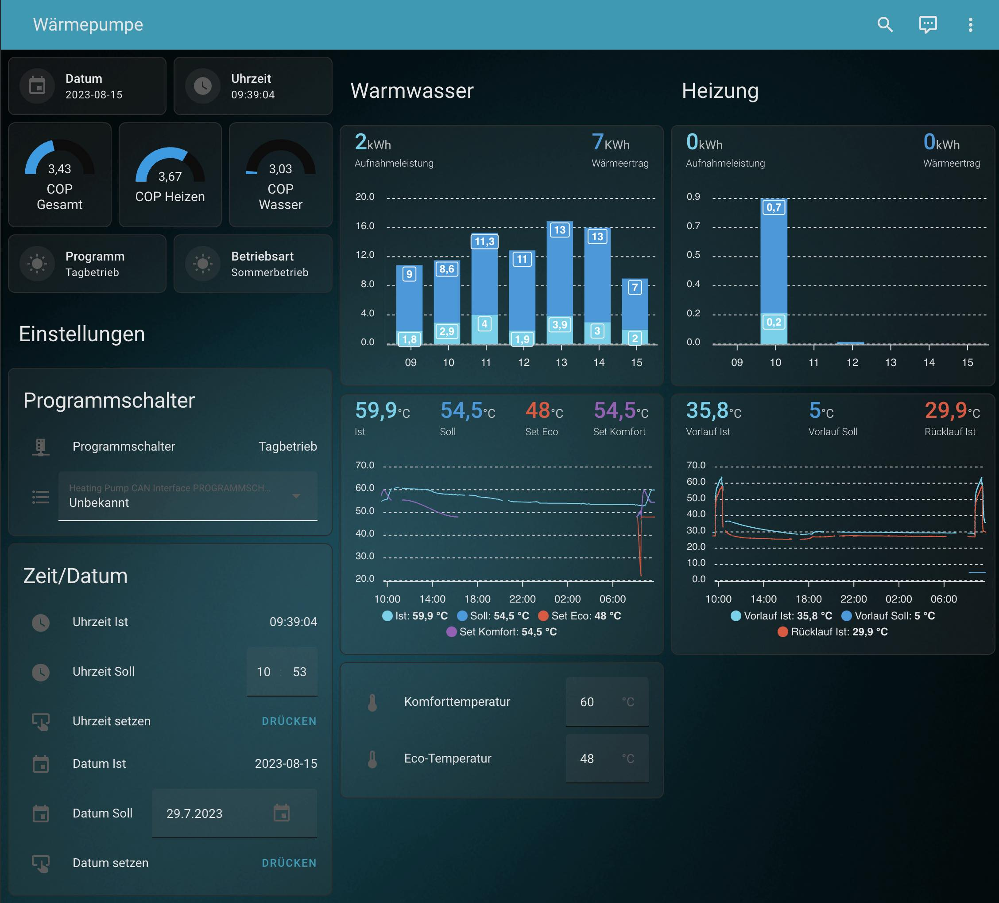

# ha-stiebel-control

ha-stiebel-control is a ESPhome / Home Assistant configuration to monitor & configure Stiebel Eltron Heating Pumps via a CAN Interface.
It requires setting up an ESP32 Microcontroller with a MCP2515 CAN-Tranceiver and some configuring in Home Assistant.
It is based on the great work of the Home Assistant community, especially the work of [roberreiters](https://community.home-assistant.io/t/configured-my-esphome-with-mcp2515-can-bus-for-stiebel-eltron-heating-pump/366053) and [Jürg Müller](http://juerg5524.ch/list_data.php).

## Installation

### ESPHome
* Set up a new ESPHome Project "heatingpump"
* Copy the Content of `heatingpump.yaml` to the new project
* Change the WiFi Credentials to yours
* Change the GPIO Pins under `spi` and `can` to your HW configuration
* You may want to check/change the CAN IDs of the Manager, Kessel, etc. You find these in the lower part of the `heatingpump.yaml` file, e.g. here:
```yaml
#########################################
#                                       #
#   HEIZMODUL Nachrichten               #
#                                       #
#########################################
    - can_id: 0x500
      then:
        - lambda: |-
            unsigned short canId = 500;
```
### Home Assistant
#### Entities and Helpers
* place the file `ha_stiebel_control.yaml` in your `/config/packages/` folder in Home Assistant.
* add the package folder to your `configuration.yaml` under `homeassistant` (if not already set up)
```yaml
homeassistant:
  packages: !include_dir_named packages
```
#### Dashboard
* Install the lovelace card [apexcharts-card](https://github.com/RomRider/apexcharts-card)
* Install the lovelace card [lovelace-mushroom](https://github.com/piitaya/lovelace-mushroom)
* Create a new Dashboard, switch to RAW mode and paste the content of `dashboard.yaml`. The result should look similar to this:



## Using
* FIXME

## Contributing

Pull requests are welcome. For major changes, please open an issue first
to discuss what you would like to change.

Please make sure to update tests as appropriate.

## License

[GPLv3] (https://www.gnu.org/licenses/gpl-3.0.en.html)